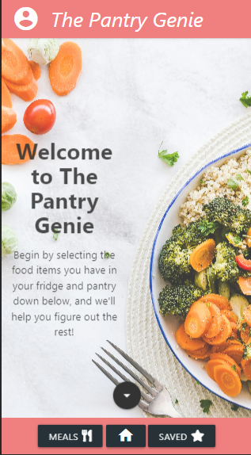
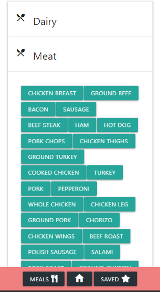
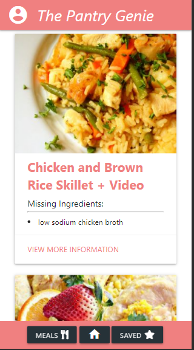
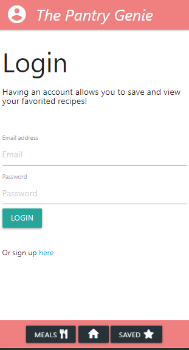
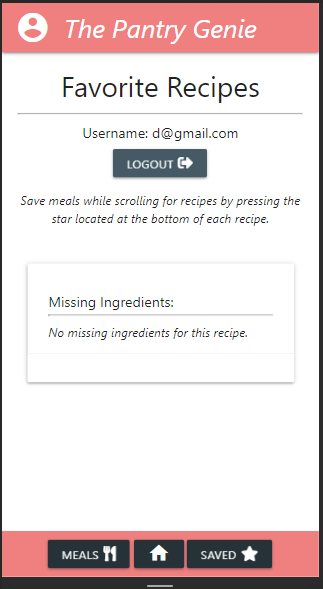

  # The Pantry Genie 

  ## My User Story
  AS someone trying to figure out what they are trying to make for dinner 
  I WANT a user friendly app that allows me to take the ingredients i have and show me possible meals I can make
  SO THAT I am less stressed about what to make for myself or for my family.       

  ## Description
  An app designed to take what the user has for food ingredients in their fridge and pantry and allow them to find recipes which maximizes what they already have. This application was built using MySQL, HTML, CSS, Materialize, Express, Node.js, Axios, Spoonacular API, Handlebars, jQuery, Passport, and Sequelize. 

  Some Challenges I faced were Learning how to implement Handlebars, Using Passport, Limited available calls to Spoonacular API, and Implementing the favorites option and tying it too who is currently logged in.

  Successes were I was able to GET data from a 3rd Party API call and present using handlebars. Buttons are togglable and item selected is pushed into an array when selected and are removed when unselected. I feel that the overall design is simple to use and has a smooth flow.

  [Project Link](https://afternoon-fjord-96402.herokuapp.com/)

  ## Table of Contents

  * [Installation](#installation)
  * [Usage](#usage)
  * [License](#license)
  * [Contributing](#contributing)
  * [Tests](#tests)
  * [Questions](#questions)

  ## Installation

  npm i

  ## Usage

  Run application by running node server.js, but the application has been deployed to heroku.

  
  
  
  
  
  

  ## License

  This project is licensed under the MIT license.

  ## Contributing
  Nothing for now

  ## Tests

  To run tests, run the following command: 

  No Tests 

  ## Questions
  If you have any questions please email me at jasoncjorgensen@gmail.com.

  Also, please see my [GitHub](https://github.com/Jason-Jorgensen)
